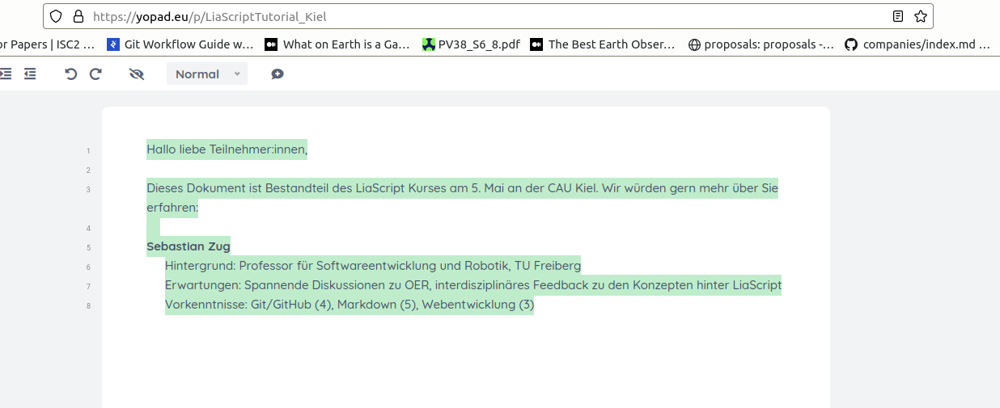

<!--
author:   Sebastian Zug, André Dietrich

email:    Sebastian.Zug@informatik.tu-freiberg.de

version:  0.0.1

language: de

narrator: Deutsch Male

mode:     Presentation

comment:  Dieser Kurs für in das Projekt LiaScript ein und diskutiert die
          Vorteile im Kontext der OER Idee.

logo:     ./images/logo.png

-->

[](https://LiaScript.github.io/course/?https://raw.githubusercontent.com/LiaPlayground/LiaScript_Tutorial_Kiel/main/A-Agenda.md)

# LiaScript Tutorial at eLearning Africa 2022

<!-- style="width: 55%; max-width: 1000px" -->

Kigali, Mai 2022

----------------------------------

Sebastian Zug, André Dietrich (TU Bergakademie Freiberg)

## Who we are?

__Prof. Dr. Sebastian Zug__: Chair of Software development and robotics

- Robotic

  + Maps and environment representations for outdoor robots
  + Aquatic robotic applications

- eLearning

  + Remote Laboratory
  + Metrics for student teamwork in computer science courses
  + _LiaScript_

__Dr. André Dietrich__

- worked on robots long too time ago  ...
- Programming languages and -paradigms
- eLearning

  - LiaScript
  - Remote Laboratories


> The introduction of all participants follows in some minutes as a first exercise ....


## LiaScript Project Motivation

    {{0}}
!?[RemoteLab-Video](https://www.youtube.com/watch?v=bICfKRyKTwE "Industrial eLab Demonstration aus Magdeburg")

    {{1}}


## What is our agenda?

| Time slot     | Content                                                 |
| ------------- | ------------------------------------------------------- |
| 9.30 – 10.00  | Introduction, Motivation                                |
| 10.00 – 10.45 | Concepts of Git/Github                                  |
| 10.45 – 11.15 | Coffee break                                            |
| 11.15 – 12.30 | Markdown Basics                                         |
| 13.30 – 15.00 | LiaScript Features and Exercises                        |
| 15.00 – 15.30 | Coffee break                                            |
| 15.30 – 16.30 | Integration of LiaScript in learning management systems |

Die Veranstaltung teilt sich in einen Motivationsblock (A-B) und einen Tutorial, dass Ihre praktische Beteiligung einbezieht.

<!-- style="display: block; margin-left: auto; margin-right: auto; max-width: 815px;" -->
```ascii

                                  .-.
                                 ( A ) Agenda and warm up
                                  '-'  
                                   |
                                   |
                                   v
                                  .-.
                                 ( B ) Visionen and Challenges when using Open
                                  '-'     Educational Ressoures (OER)
                                /     \
              Solutions I      /       \    Solutions II
              collaboration   v         v   interactive content
                             .-.       .-.
           Introduction to  ( C )     ( D )  Introduction to
           Git/Github        '-'       '-'   LiaScript
                               \       /
                                \     /
                                 v   v
                                  .-.
                                 ( 3 )  Collaborative generation of OER
                                  '-'   based on LiaScript
                                   |
                                   v
                                  .-.
                                 ( 4 )  Export and integration
                                  '-'   of LiaScript contents
                                   |
                                   v

```

{{2-3}}
> **Let's start!**

## GitHub Account

Please register your self at [github.com](www.github.com).

Afterwards you can find our materials by searching `LiaPlayground` and `LiaScript_Tutorial_Kigali`.


> **Ready to start? Yes, but we want to know more about you at the beginning ... **

## What about your expectations?

[https://yopad.eu/p/LiaScriptTutorial_Kiel](https://yopad.eu/p/LiaScriptTutorial_Kigali)



1. What is your background - Name, affiliation, (teaching-)topic?
2. What do you expect from this tutorial?
3. How would you rate your knowledge related to
     + Git/Github
     + Markdown
     + Web development (html, javascript)?
   Please chose a "1" for novice and "5" for expert!

{{1-3}}
> **Reflexion - Content:** A broad spectrum of attendees :-)


{{2-3}}
> **Reflexion - Aggregation:** Collaborative writing process of a document - the final version remains visible at the end.
