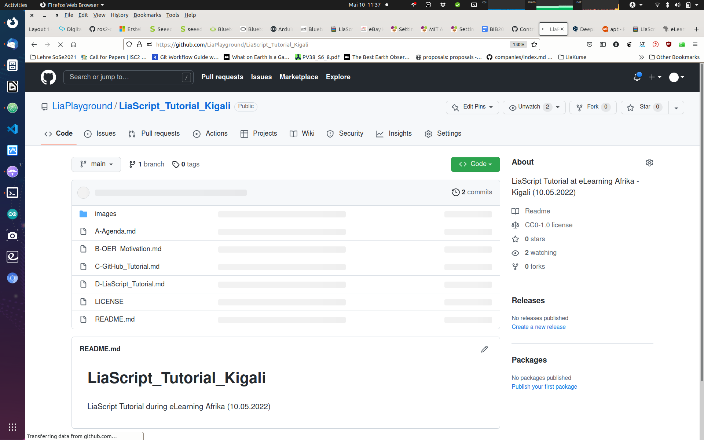

<!--

author:   Sebastian Zug, André Dietrich 
email:    sebastian.zug@informatik.tu-freiberg.de
version:  0.0.2

language: de
narrator: Deutsch Female

icon: https://upload.wikimedia.org/wikipedia/commons/d/de/Logo_TU_Bergakademie_Freiberg.svg
-->

[](https://LiaScript.github.io/course/?https://raw.githubusercontent.com/LiaPlayground/LiaScript_Tutorial_Kigali/main/C-GitHub_Tutorial.md)

# Github Introduction

Let's start!

## Version management - Why?

                                   {{0-2}}
******************************************************************************

What was the largest document you have worked on so far? How did you organize your progress?

1. in the worst case you didn't think about it at all and wrote into the same document over and over again.
2. a touch better is the idea of making new copies of the folder weekly and naming them something like this:

```console
▶ ls
myProject
myProject_test
myProject_newTest
myProject_Moms_corrections
...
```

3. If you "had a plan", you made a copy of all files in a folder every day and named them systematically.

```console
▶ ls
myProject_01042021
myProject_02042021
myProject_03042021
...
```

******************************************************************************


                          {{1-2}}
******************************************************************************

Briefly consider how to find answers to the following questions:

* "When was the last state of file x.y deleted?"
* "In which version did I make the adjustment to the headings?"
* "How can I undo this despite other changes made in the meantime?"
* "Why didn't I make a copy of this?"
* "..."

In any case, a lot of manual work ...

******************************************************************************

                          {{2-3}}
******************************************************************************

> In software development, this problem is solved by version management systems. We want to apply the existing methods for this to OER.

******************************************************************************

## Version management

> Definition: A version management is a system used to record changes to documents or files. All versions are saved in an archive with a time stamp and user ID and can be restored later. Version management systems are typically used in software development to manage source code.

                                {{1-2}}
******************************************************************************

Example - Wikipedia version management system


Features:

+ Logging of changes: It can be traced at any time who changed what and when.
+ Restoration of old states of individual files: Thus, accidental changes can be undone at any time.
+ Archiving of individual statuses of a project: This makes it possible to access all versions at any time.
+ Coordination of shared access to files by several developers.
+ Simultaneous development of several development branches of a project, which must not be confused with the fork of another project.

******************************************************************************

## Git 

The development history of git is connected to the Linux kernel with tousands of contributors   

| year | method of version control                        |
| ---- | -------------------------------------------------------------- |
| 1991 | Changes to the Linux kernel via patches and archive files |
| 2002 | Linux kernel managed with the BitKeeper tool |
| 2005 | Break between the distributing company and the Linux community |
| 2021 | The current version is 2.31.1 |

In 2005 a list of requirements for a new development was defined. It was emphasized that it must be able to support especially very large projects (number of developers, features and lines of code, files). From this `Git` was developed as free software for distributed version management of files.

> Git dominates software development either as a single installation or embedded in various development platforms!

### State model of a file in Git

Files can have different states with which they are marked in Git repositories.

                       {{0-1}}
********************************************************************************

```text @plantUML.png
@startuml
hide empty description
[*] --> Untracked : Generation of a file
Untracked --> Staged : Added to repository
Unmodified --> Modified : Adaptations
Modified --> Staged : Attributed as a new version
Staged --> Unmodified : Accepted 
Unmodified --> Untracked : Deleted from repository
@enduml
```

********************************************************************************

### Basic usage

The state model of a file results in three levels on which we can classify a file in Git perspective - working directory, stage and repository.

```ascii
                     local                           remote
  ---------------------------------------------  --------------
  Working         "Staging"        local          remote
  copy                             repository     repository
                       |               |
                       |               |
                       |               |
       +-+- - - - - - -|- - - - - - - -|
       | | Adaptations |               |
       | |             |               |
       +-+             |               |
        |   git add    |               |
        |------------->|  git commit   |
        |              |-------------->|
       +-+             |               |
       | | further     |               |
       | | Adaptations |               |
       +-+             |               |
        |   git add    |               |
        +------------->|  git commit   |
                       |-------------->|
                       |               |                                           .
```


###  Distributed version mamangement

<!--
style="width: 100%; max-width: 560px; display: block; margin-left: auto; margin-right: auto;"
-->
```ascii
                      local                           remote
   ---------------------------------------------  --------------
   Working         "Staging"        local          remote
   copy                             repository     repository
                       |               |                 |
                       |               |    git clone    |
                       |               |<----------------|
       +-+- - - - - - -|- - - - - - - -|                 |
       | | Adaptations |               |                 |
       | |             |               |                 |
       +-+             |               |                 |
        |   git add    |               |                 |
        |------------->|  git commit   |                 |
        |              |-------------->|                 |
       +-+             |               |                 |
       | | further     |               |                 |
       | | Adaptations |               |                 |
       +-+             |               |                 |
        |   git add    |               |                 |
        +------------->|  git commit   |                 |
                       |-------------->|   git push      |
                       |               |---------------->|
                       |               |                 |                     .
```


### Arbeiten mit Branches

The organization of versions in different branches is a central element of working with git.
element of working with git. Branches are branches of code that encapsulate specific development
development goals.

<!--
style="width: 100%; max-width: 560px; display: block; margin-left: auto; margin-right: auto;"
-->
```ascii

        vSoSe2019                                                   vSoSe2020
main     O-----------------------------------------  ....  ---------O
          \                                                        ^
           \        Current Course Versionen                      /
SoSe2020    \              O-->O                 O          ---->O
             \            ^     \               /
              v          /       v             /
SoSe2020dev    O->O---->O---->O->O---->O-->O->O      ....
               Lecture      Lecture
               00             01
```

A branch in Git is simply a pointer to a commit. The central branch is usually referred to as `master` (old name) or `main` (new name).

## GitHub

Github is a platform that offers online Git version management and adds it to a project management. Besides coordinating the versions, they can be linked to tasks, milestones can be checked and certain tasks can be executed automatically.



> Let's take a closer view and generate your first Github project.