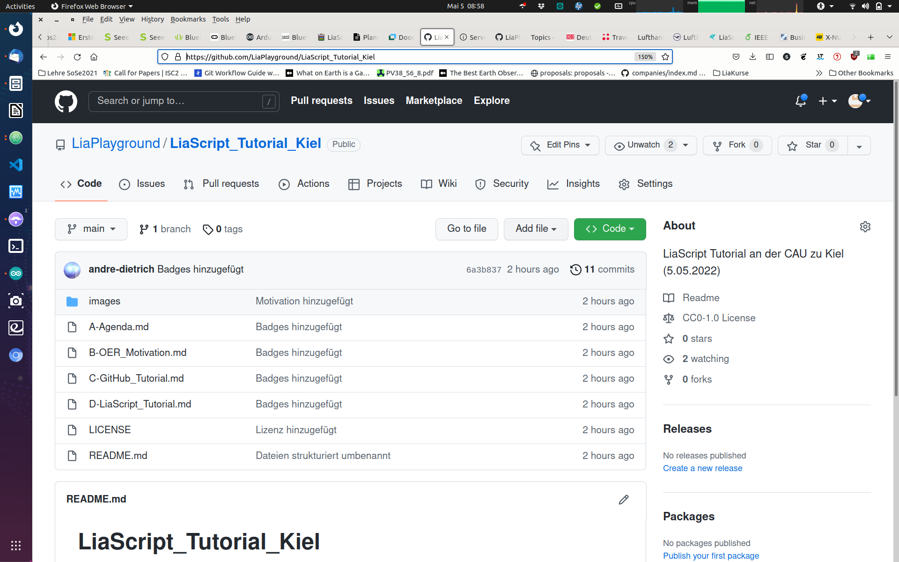

<!--

author:   Sebastian Zug, Galina Rudolf, André Dietrich & `JohannaKlinke`
email:    sebastian.zug@informatik.tu-freiberg.de
version:  1.0.6

language: de
narrator: Deutsch Female

import: https://github.com/liascript/CodeRunner
        https://raw.githubusercontent.com/liaTemplates/ExplainGit/master/README.md
        https://raw.githubusercontent.com/liascript-templates/plantUML/master/README.md
        https://github.com/LiaTemplates/Pyodide

icon: https://upload.wikimedia.org/wikipedia/commons/d/de/Logo_TU_Bergakademie_Freiberg.svg
-->

[](https://LiaScript.github.io/course/?https://raw.githubusercontent.com/LiaPlayground/LiaScript_Tutorial_Kiel/main/C-GitHub_Tutorial.md)

# Github-Tutorial

Es wird ernst :-)

## Warum Versionsmanagement?

                                   {{0-2}}
******************************************************************************

Was war das umfangreichste Dokument, an dem Sie bisher gearbeitet haben? Wie haben Sie Ihren Fortschritt organisiert?

1. Im schlimmsten Fall haben Sie sich gar keine Gedanken gemacht und immer wieder ins gleiche Dokument geschrieben.
2. Eine Spur besser ist die Idee wöchentlich neue Kopien des Ordners anzulegen und diese in etwa so zu benennen:

```console
▶ ls
myProject
myProject_test
myProject_newTest
myProject_Moms_corrections
...
```

3. Wenn Sie "einen Plan hatte", haben Sie täglich eine Kopie aller Dateien in einem Ordner angelegt und diese systematisch benannt.

```console
▶ ls
myProject_01042021
myProject_02042021
myProject_03042021
...
```

In den Ordnern gab es dann aber wieder das gleiche Durcheinander wie in (2), weil Sie bestimmte Texte gern kurzfristig sichern wollten. Teilweise haben sie diese dann gelöscht bevor die Kopie erstellt wurde, meistens aber einfach in einem `sonstiges` Ordner belassen.

******************************************************************************


                          {{1-2}}
******************************************************************************

Überlegen Sie sich kurz, wie Sie vorgehen müssen, um Antworten auf die folgenden Fragen zu finden:

* "Wann wurde der letzte Stand der Datei x.y gelöscht?"
* "In welcher Version habe ich die Anpassung der Überschriften vorgenommen?"
* "Wie kann ich dies trotz anderer zwischenzeitlicher Änderungen rückgängig machen?"
* "Warum habe ich davon keine Kopie gemacht?"
* "..."

In jedem Fall viel manuelle Arbeit ...

******************************************************************************

                          {{2-3}}
******************************************************************************

Und nun übertragen wir den Ansatz auf eine Softwareentwicklungsprojekt mit vielen Mitstreitern. Die Herausforderungen potenzieren sich.

1. Die Erstellung der Tageskopie müsste synchron erfolgen.
2. Ich muss in die Ordner schauen, um zu sehen welche Anpassungen vorgenommen wurden.
3. Ich weiß nicht welche die aktuelle Version einer Datei ist.
4. Es existieren plötzlich mehrere Varianten einer Datei mit Änderungen an unterschiedlichen Codezeilen.
5. Ich kann den Code nicht kompilieren, weil einzelne Dateien fehlen.
6. Ich kann eine ältere Version der Software nicht finden - "Gestern hat es noch funktioniert".
7. Meine Änderungen wurden von einem Mitstreiter einfach überschrieben.

******************************************************************************

## Lösungsansatz

> Definition: Eine Versionsverwaltung ist ein System, das zur Erfassung von Änderungen an Dokumenten oder Dateien verwendet wird. Alle Versionen werden in einem Archiv mit Zeitstempel und Benutzerkennung gesichert und können später wiederhergestellt werden. Versionsverwaltungssysteme werden typischerweise in der Softwareentwicklung eingesetzt, um Quelltexte zu verwalten.

Beispiel - Versionsmanagementsystem von Wikipedia


                                {{1-2}}
******************************************************************************

Hauptaufgaben:

+ Protokollierungen der Änderungen: Es kann jederzeit nachvollzogen werden, wer wann was geändert hat.
+ Wiederherstellung von alten Ständen einzelner Dateien: Somit können versehentliche Änderungen jederzeit wieder rückgängig gemacht werden.
+ Archivierung der einzelnen Stände eines Projektes: Dadurch ist es jederzeit möglich, auf alle Versionen zuzugreifen.
+ Koordinierung des gemeinsamen Zugriffs von mehreren Entwicklern auf die Dateien.
+ Gleichzeitige Entwicklung mehrerer Entwicklungszweige (engl. Branch) eines Projektes, was nicht mit der Abspaltung eines anderen Projekts (engl. Fork) verwechselt werden darf.

******************************************************************************

### Identifikation von Unterschieden

Zunächst einmal müssen wir feststellen an welchen Stellen es überhaupt Unterschiede
gibt. Welche Differenzen sehen Sie zwischen den beiden Dokumenten:

```markdown                      DokumentV1.md
TU
Bergakademie
Freiberg
Softwareentwicklung
Online Course
Sommersemester 2020
Lorem ipsum dolor sit amet, CONSETETUR sadipscing elitr, sed diam nonumy eirmod tempor invidunt ut labore et dolore magna aliquyam erat, sed diam voluptua. At vero eos et accusam et justo duo dolores et ea rebum. Stet clita kasd gubergren, no sea takimata sanctus est Lorem ipsum dolor sit amet.
```

```markdown                      DokumentV2.md


TU
Bergakademie
Freiberg
Softwareentwicklung
Sommersemester 2019
Lorem ipsum dolor sit amet, consetetur sadipscing elitr, sed diam nonumy eirmod tempor invidunt ut labore et dolore magna aliquyam erat, sed diam voluptua. At vero eos et accusam et justo duo dolores et ea rebum. Stet clita kasd gubergren, no sea takimata sanctus est Lorem ipsum dolor sit amet.
```

Offenbar wurden sowohl Lehrzeichen, als auch neue Zeilen eingeführt. In anderen Zeilen wurden Inhalte angepasst.

Nutzen wir das Tool `diff` um diese Änderungen automatisiert festzustellen. Die Zeilen, die mit `>` beginnen, sind nur in der ersten Datei vorhanden, diejenigen, die mit `<`, markieren das Vorkomen in der zweiten Datei. Die einzelnen Blöcke werden durch sogenannte change commands („Änderungsbefehle“) getrennt, die angeben, welche Aktion (Zeilen hinzufügen – a, ändern – c oder entfernen – d) in welchen Zeilen ausgeführt wurde.

```console
▶diff DokumentV1.md DokumentV2.md
0a1,3
>
>
>
5,7c8,9
< Online Course
< Sommersemester 2020
< Lorem ipsum dolor sit amet, CONSETETUR sadipscing elitr, ...
---
> Sommersemester 2019
> Lorem ipsum dolor sit amet, consetetur sadipscing elitr, ...
```

> **Merke**: Sehr lange Zeilen erschweren die Suche nach wirklichen Änderungen!

###  Merge von Versionen

Optimistische Versionsverwaltungen (*Copy Modify Merge*) versuchen die die Schwächen der pessimistischen Versionsverwaltung zu beheben, in dem sie gleichzeitige Änderungen durch mehrere Benutzer an einer Datei zu lassen und anschließend diese Änderungen automatisch oder manuell zusammen führen (Merge).

<!--
style="width: 100%; max-width: 560px; display: block; margin-left: auto; margin-right: auto;"
-->
```ascii
+----------------------------+---------------------------+
|        Repository          |       Repository          |
|        +-------+           |       +-------+           |
|        |   A   |           |       |   A   |           |
|        +-------+           |       +-------+           |
|         /     \            |                           |
|    read/       \read       |                           |
|       /         \          |                           |
|      v           v         |                           |
| +-------+    +-------+     | +-------+   +-------+     |
| |   A   |    |   A   |     | |   A'  |   |  A''  |     |
| +-------+    +-------+     | +-------+   +-------+     |
|   Harry        Sally       |   Harry       Sally       |
|                            |                           |
| Erzeugen der lokalen Kopie | Barbeitung                |
+----------------------------+---------------------------+
|        Repository          |       Repository          |
|        +-------+           |       +-------+           |
|        |  A''  |           |       |  A''  |           |
|        +-------+           |       +-------+           |
|              ^             |         X                 |
|               \write       |   write/                  |
|                \           |       /                   |
|                 \          |      /                    |
| +-------+    +-------+     | +-------+   +-------+     |
| |   A'  |    |  A''  |     | |   A'  |   |  A''  |     |
| +-------+    +-------+     | +-------+   +-------+     |
|   Harry        Sally       |   Harry       Sally       |
|                            |                           |
|Sally schreibt ihre Version |Harries Schreibversuch wird|
|                            |blockiert                  |
+----------------------------+---------------------------+
|        Repository          |       Repository          |
|        +-------+           |       +-------+           |
|        |  A''  |           |       |  A''  |           |
|        +-------+           |       +-------+           |
|         /                  |                           |
|    read/                   |                           |
|       /                    |                           |
|      v                     |                           |
| +-------+    +-------+     | +-------+   +-------+     |
| | A',A''|    |  A''  |     | |   A*  |   |  A''  |     |
| +-------+    +-------+     | +-------+   +-------+     |
|   Harry        Sally       |   Harry       Sally       |
|                            |                           |
| Mergen der Kopien          | merge(A',A'')=A*          |
+----------------------------+---------------------------+
|        Repository          |       Repository          |
|        +-------+           |       +-------+           |
|        |   A*  |           |       |   A*  |           |
|        +-------+           |       +-------+           |
|         ^                  |              \            |
|   write/                   |               \read       |
|       /                    |                \          |
|      /                     |                 v         |
| +-------+    +-------+     | +-------+   +-------+     |
| |   A*  |    |  A''  |     | |   A*  |   |   A*  |     |
| +-------+    +-------+     | +-------+   +-------+     |
|   Harry        Sally       |   Harry       Sally       |
|                            |                           |
|Harry schreibt seine Version|Sally übermittelt A''      |
+----------------------------+---------------------------+                     .
```

Welche Konsequenzen ergeben sich daraus?

+ Unser Dokument muss überhaupt kombinierbar sein! Auf ein binäres Format ließe sich das Konzept nicht anwenden!
+ Das Dokument liegt in zeitgleich in n-Versionen vor, die ggf. überlappende Änderungen umfassen.
+ Das zentrale Repository kennt die Version von Harry nur indirekt. Man kann zwar indirekt aus A'' und A* auf A' schließen, man verliert aber zum Beispiel die Information wann Harry seine Änderungen eingebaut hat.

> Die Herausforderung liegt somit im Mischen von Dokumenten!

[^Subversion]: Brian W. Fitzpatrick, Ben Collins-Sussman, C. Michael Pilato, Version Control with Subversion, 2nd Edition, O'Reilly Media

## Git

**Geschichte und Einsatz**

Die Entwicklungsgeschichte von git ist mit der des Linux Kernels verbunden:

| Jahr | Methode der Versionsverwaltungen                               |
| ---- | -------------------------------------------------------------- |
| 1991 | Änderungen am Linux Kernel via patches und archive files       |
| 2002 | Linux Kernel mit dem Tool BitKeeper verwaltet                  |
| 2005 | Bruch zwischen der vertreibenden Firma und der Linux Community |
| 2021 | Die aktuelle Version ist 2.31.1                                |

2005 wurde einen Anforderungsliste für eine Neuentwicklung definiert. Dabei wurde hervorgehoben, dass sie insbesondere sehr große Projekte (Zahl der Entwickler, Features und Codezeilen, Dateien) unterstützen können muss. Daraus entstand `Git` als freie Software zur verteilten Versionsverwaltung von Dateien.

> Git dominiert entweder als einzelne Installation oder aber eingebettet in verschiedene Entwicklungsplattform die Softwareentwicklung!

### Zustandsmodell einer Datei in Git

Dateien können unterschiedliche Zustände haben, mit denen sie in Git-Repositories markiert sind.

                       {{0-1}}
********************************************************************************

```text @plantUML.png
@startuml
hide empty description
[*] --> Untracked : Erzeugen einer Datei
Untracked --> Staged : Hinzufügen zum Repository
Unmodified --> Modified : Editierung der Datei
Modified --> Staged : Markiert als neue Version
Staged --> Unmodified : Bestätigt als neue Version
Unmodified --> Untracked : Löschen aus dem Repository
@enduml
```

********************************************************************************

### Grundlegende Anwendung

> **Merke:** Anders als bei svn können Sie mit git eine völlig autonome Versionierung auf Ihrem Rechner realisieren. Ein Server ist dazu *zunächst* nicht nötig.

Aus dem Zustandmodell einer Datei ergeben sich drei Ebenen auf der wir eine Datei in Git Perspektivisch einordnen können - Arbeitsverzeichis, Stage und Repository.

> **Achtung:** Die folgende Darstellung dient hauptsächlich der didaktischen Hinführung zum Thema!

```ascii
                     lokal                           remote
  ---------------------------------------------  --------------
  Arbeitskopie     "Staging"        Lokales          Remote
                                   Repository      Repository
                       |               |
                       |               |
                       |               |
       +-+- - - - - - -|- - - - - - - -|
       | | Änderungen  |               |
       | |             |               |
       +-+             |               |
        |   git add    |               |
        |------------->|  git commit   |
        |              |-------------->|
       +-+             |               |
       | | weitere     |               |
       | | Änderungen  |               |
       +-+             |               |
        |   git add    |               |
        +------------->|  git commit   |
                       |-------------->|
                       |               |                                                 |               |                                       .
```


###  Verteiltes Versionsmanagement

<!--
style="width: 100%; max-width: 560px; display: block; margin-left: auto; margin-right: auto;"
-->
```ascii
                     lokal                           remote
  ---------------------------------------------  --------------
  Arbeitskopie     "Staging"        Lokales          Remote
                                   Repository      Repository
                       |               |                 |
                       |               |    git clone    |
                       |               |<----------------|
       +-+- - - - - - -|- - - - - - - -|                 |
       | | Änderungen  |               |                 |
       | |             |               |                 |
       +-+             |               |                 |
        |   git add    |               |                 |
        |------------->|  git commit   |                 |
        |              |-------------->|                 |
       +-+             |               |                 |
       | | weitere     |               |                 |
       | | Änderungen  |               |                 |
       +-+             |               |                 |
        |   git add    |               |                 |
        +------------->|  git commit   |                 |
                       |-------------->|   git push      |
                       |               |---------------->|
                       |               |                 |                     .
```


_Kooperatives Arbeiten:_ Nehmen wir nun an, dass Ihr Kollege in dieser Zeit selbst das Remote Repository fortgeschrieben hat. In diesem Fall bekommen Sie bei Ihrem `push` eine Fehlermeldung, die sie auf die neuere Version hinweist. Nun "ziehen" Sie sich den aktuellen
Stand in Ihr Repository und kombinieren die Änderungen. Sofern keine Konflikte
entstehen, wird daraus ein neuer Commit generiert, den Sie dann mit Ihren Anpassungen an das Remote-Repository senden.

<!--
style="width: 100%; max-width: 560px; display: block; margin-left: auto; margin-right: auto;"
-->
```ascii
                     lokal                           remote
  ---------------------------------------------  --------------
  Arbeitskopie     "Staging"        Lokales          Remote
                                   Repository      Repository
                       |               |                 |
                       |               |    git clone    |
                       |               |<----------------|
       +-+- - - - - - -|- - - - - - - -|                 |
       | | Änderungen  |               |                 |
       | |             |               |                 |
       +-+             |               |                 |
        |   git add    |               |                 |
        |------------->|  git commit   |                 |
        |              |-------------->|                 |
       +-+             |               |                 |
       | | weitere     |               |                 |
       | | Änderungen  |               |                 |   git push
       +-+             |               |                 |<-------------
        |   git add    |               |                 |
        +------------->|  git commit   |                 |
                       |-------------->|   git push      |
                       |               |---------------X |
                       |               |   git fetch     |
                       |               |<--------------- |     git fetch
                       |               |   git merge     |   + git merge
                       |               |<--------------- |   = git pull
                       |               |   git push      |
                       |               |---------------->|                   .
```


Versuchen wir das ganze noch mal etwas plastischer nachzuvollziehen. Rechts oben sehen Sie unser Remote-Repository auf dem Server. Im mittleren Bereich den Status unseres lokalen Repositories.


``` text @ExplainGit.eval
create origin
```

### Arbeiten mit Branches

Die Organisation von Versionen in unterschiedlichen Branches ist ein zentrales
Element der Arbeit mit git. Branches sind Verzweigungen des Codes, die bestimmte
Entwicklungsziele kapseln.

Der größte Nachteil bei der Arbeit mit nur einem Branch liegt darin, dass bei einem
defekten Master(-Branch) die Arbeit sämtlicher Beteiligter unterbrochen wird. Branches
schaffen einen eignen (temporären) Raum für die Entwicklung neuer Features, ohne
die Stabilität des Gesamtsystems zu gefährden. Gleichzeitig haben die Entwickler den gesamten Verlauf eines Projekts in strukturierter Art zur Hand.

Wie sieht das zum Beispiel für die Kursmaterialien der Vorlesung `Softwareentwicklung` aus?

<!--
style="width: 100%; max-width: 560px; display: block; margin-left: auto; margin-right: auto;"
-->
```ascii

        vSoSe2019                                                   vSoSe2020
main     O-----------------------------------------  ....  ---------O
          \                                                        ^
           \               Offizielle Versionen                   /
SoSe2020    \              O-->O                 O          ---->O
             \            ^     \               /
              v          /       v             /
SoSe2020dev    O->O---->O---->O->O---->O-->O->O      ....
               Vorlesung      Vorlesung
               00             01
```

Ein Branch in Git ist einfach ein Zeiger auf einen Commit zeigt. Der zentrale Branch wird zumeist als `master` (alte Bezeichnung) oder `main` (neue Bezeichnung) bezeichnet.


## Ein Wort zur Zusammenarbeit

Bitte haben Sie immer den spezifischen Kontext Ihres Projektes vor Augen. Üblicherweise legt man am Anfang, bei einem "kleinen Hack" keinen Wert auf formelle Abläufe und Stukturen. Diese sind
aber in großen Projekten unablässig.


<!-- width="100%" -->

```
Kurze (72 Zeichen oder weniger) Zusammenfassung

Ausführlicherer erklärender Text. Umfassen Sie ihn auf 72 Zeichen. Die Leerzeile
Zeile, die die Zusammenfassung vom Textkörper trennt, ist entscheidend (es sei
denn, Sie lassen den den Textkörper ganz weg).

Schreiben Sie Ihre Commit-Nachricht im Imperativ: "Fix bug" und nicht "Fixed
Fehler" oder "Behebt Fehler". Diese Konvention stimmt mit den Commit-Nachrichten
überein die von Befehlen wie "git merge" und "git revert" erzeugt werden.

Weitere Absätze kommen nach Leerzeilen.

- Aufzählungspunkte sind für eine Liste von Anpassungen in Ordnung.
- ... und noch einer
```
Folgende Regeln sollte man für die Beschreibung eines Commits berücksichtigen:

+ Trennen Sie den Betreff durch eine Leerzeile vom folgenden Text
+ Beschränkt Sie sich bei der Betreffzeile auf maximal 50 Zeichen
+ Beginnen Sie die Betreffzeile mit einem Großbuchstaben
+ Schreiben Sie die Betreffzeile im Imperativ
+ Brechen Sie den Text der Message 72 Zeichen um


> **Merke:** Beschreiben Sie in der Commit-Nachricht das was und warum, aber nicht das wie.

## Los geht's

<!-- width="100%" -->
