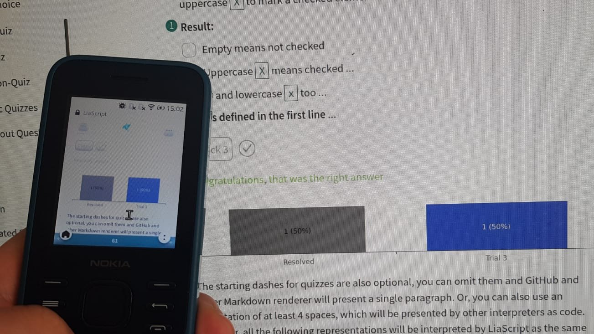

<!--
author:   Your Name

email:    your@mail.org

version:  0.0.1

language: en

narrator: US English Female

comment:  Full day workshop at eLearning Africa 2022.

-->

To see this course in the interactive LiaScript-version, click [here](https://LiaScript.github.io/course/?https://raw.githubusercontent.com/LiaPlayground/LiaScript_Tutorial_Kigali/main/README.md).

# LiaScript Tutorial: eLearning Africa 2022



Hello and welcome, this is an updated version of our interactive hands on course on creating interactive OER online/offline courses with LiaScript.
It is a distributed way of creating and sharing educational content without the need of a centralized server or backend system.

> This course is hosted freely on [GitHub](https://github.com): https://github.com/LiaPlayground/LiaScript_Tutorial_Kigali
>
> and can be shared freely, forked, adapted, translated, etc.

This is a hands on tutorial. You can fork this course from [GitHub](https://github.com/LiaPlayground/LiaScript_Tutorial_Kigali) or simply copy the text file directly from the [README.md](https://github.com/LiaPlayground/LiaScript_Tutorial_Kigali/blob/main/README.md) into your editor and start go through it step by step.

Where can you find additional resources:

* __Project-Website:__ https://LiaScript.github.io
* __Open-Source:__ https://github.com/liascript
* __YouTube:__ https://www.youtube.com/channel/UCyiTe2GkW_u05HSdvUblGYg
* __Additional resources:__

  - Documentation: https://github.com/LiaScript/docs
  - Free books: https://github.com/LiaBooks
  - Templates: https://github.com/topics/liascript-template
  - Courses & ...: https://github.com/topics/liascript-course
  - Blog: https://aizac.herokuapp.com

* __Editor:__ https://code.visualstudio.com/Download

  - Liascript-Preview: https://marketplace.visualstudio.com/items?itemName=LiaScript.liascript-preview
  - Liascript-Snippets: https://marketplace.visualstudio.com/items?itemName=LiaScript.liascript-snippets

* __Development-Server:__ https://www.npmjs.com/package/@liascript/devserver

* __Exporter:__ https://www.npmjs.com/package/@liascript/exporter


## Setup

> If you just want to develop locally, it is enough to download the editor and install the plugins from the Extensions (Marketplace).
> Create a README.md and copy the content from [here](https://github.com/LiaPlayground/LiaScript_Tutorial_Kigali/blob/main/README.md)

1. Create an account at: https://github.com
2. Download the Editor at: https://code.visualstudio.com/Download
3. Open the Marketplace and search for liascript:

   search and "install" the following plugins:

   1. liascript-preview
   2. liascript-snippets

> **important keyboard short-cuts**
>
> * Fuzzy Search for commands: <kbd>Ctrl</kbd> + <kbd>Shift</kbd> + <kbd>P</kbd>
> * Open the LiaScript preview: <kbd>Alt</kbd> + <kbd>L</kbd>
> * Save: <kbd>Shift</kbd> + <kbd>S</kbd>
> * Move lines: <kbd>Alt</kbd> + <kbd>ᐃ/ᐁ</kbd>
> * __LiaScript__ snippets:
>
>   - Snippets: <kbd>l</kbd> <kbd>i</kbd> <kbd>a</kbd>
>   - Programming languages: <kbd>h</kbd> <kbd>i</kbd> <kbd>l</kbd> <kbd>i</kbd>
>   - Voices: <kbd>v</kbd> <kbd>o</kbd> <kbd>i</kbd> <kbd>c</kbd> <kbd>e</kbd>

## Share your course via ...

> You can basically use any kind of webspace to share your course with your audience.
> Simply replace the `YOUR_COURSE_URL` within the example below with your personal URL of your course URL.
> 
> For this course it is: https://raw.githubusercontent.com/LiaPlayground/LiaScript_Tutorial_Kigali/main/README.md
> 
> Thus the result looks like this: https://LiaScript.github.io/course/?https://raw.githubusercontent.com/LiaPlayground/LiaScript_Tutorial_Kigali/main/README.md


**`https://LiaScript.github.io/course/?YOUR_COURSE_URL`**


    {{1}}
* Open-source platforms:

  - [GitHub](https://github.com)
  - [GitLab](https://gitlab.com)

    {{2}}
* Private document stores:

  - [DropBox](https://DropBox.com)
  - [nextCloud](https://nextCloud.com)

    {{3}}
* Peer to Peer browsers and protocols.

  - [Brave Browser](https://brave.com) via [IPFS](https://ipfs.io)
  - [Beaker Browser](https://beakerbrowser.com) via [Hyper](https://hypercore-protocol.org)

    !?[Beaker-Browser demo](https://beakerbrowser.com/beaker-site-demo.mp4)<!-- autoplay="true" -->

    {{4}}
* Anything else and more to come ...

  - [Onion-Share](https://onionshare.org)
  - free webspace
  - online editors like [CodiLia](https://github.com/liaScript/codilia)


## Markdown?


> ~~__Markdown is intended to be as easy-to-read and easy-to-write as is feasible.__~~
>
> Readability, however, is emphasized above all else.
> A Markdown-formatted document ~~__should be publishable as-is__~~, as plain text, without looking like it’s been marked up with tags or formatting instructions.
> While Markdown’s syntax has been influenced by several existing text-to-HTML filters — including Setext, atx, Textile, reStructuredText, Grutatext, and EtText — the single ~~__biggest source of inspiration__~~ for Markdown’s syntax is the format of ~~__plain text email__~~.
>
>To this end, Markdown’s syntax is comprised entirely of punctuation characters, which ~~__punctuation characters have been carefully chosen so as to look like what they mean__~~.
> E.g., asterisks around a word actually look like \*emphasis\*. Markdown ~~__lists look like, well, lists__~~.
> Even ~~__blockquotes look like quoted passages of text__~~, assuming you’ve ever used email.
>
> -- by [John Gruber](https://daringfireball.net/projects/markdown/syntax#philosophy)


Headers

By now you should have noticed, that # (hash-tags) are used to structure your content.
The number of # defines the header-type and indentation.

------------------------

Task:

Try to add hash-tags in front of the header and experiment with it.

### Paragraphs

A paragraph and other markdown-blocks, that we will get to know, are separated visually from each other by empty lines.
These lines are thus interpreted as one single paragraph.

---

Task:

Add two more paragraphs and try out, if the number of empty lines in between has an effect on the representation of the content.

### Lists

Bullet points in an unordered list indicated by starting *, -, or + and require indentation:

* A list always starts with the first bullet point
* A bullet point can consist of multiple parts.

  The only thing you will have to keep in mind is the correct indentation.

* A list can also contain further lists:

  + These do not necessarily have to start with an asterisks
  + But it is good practice if you use different symbols for different nesting

------------------------

Task:

Add some more bullet points the list, where you write down some comments your experiences with indentation.

#### Numbered lists

Markdown has also support for numbered lists, which can be used in combination with "unordered" lists.


1. First
2. Second
3. ...

Task:

Write some useful comments on the usage of numbered lists
and create an example, where you combine numbered and not numbered bullet points.

### Formatting

Highlighting peaces of the text with only a text-editor might seem tricky at first.
But, you can use different elements to tag your content.

* `code`: this type is required if you want to highlight elements as code, the markdown interpreter will leave everything as it is (including Markdown syntax)

* italic: surround the word or the text with either `*` or  `_`.

* bold: think of two times as important as italic, thus it is surround by two `**` or `__`.

* bold and italic: how would you now try to define this and try out some nested combinations.

* Task: If you are using WhatsApp, you could write some messages with this formatting.
  WhatsApp has support for some pieces of markdown-syntax.

* crossed out: if you use `~` similarly to bold and italic, you will get a similar effect.

* underlined: ???

* crossed out and underlined: follow the markdown idea ;-)

* superscript: it is not Markdown but LiaScript, but you can use `^` to surround superscript elements

### Block-quotes

> If you want to highlight an entire text as important, then add a `> ` to the the beginning of every line.
> Early emails were an inspiration for this notation.
>
> **Within the following parts, we will use this syntax to mark tasks**

---

Question: Can blockquotes be nested?

### Links & References

Nothing within the Internet works without links. You can use them everywhere within the document, but Markdown has also support for named and internal links.

https://liascript.github.io/course/?https://raw.githubusercontent.com/liaScript/docs/master/README.md#1

The syntax for named links is: `[name](url)`

> **Task 1:** Try to write the previous link as a named link.
>
> **Task 2:** Try to highlight your new link as bold.

---

Internal links follow a similar pattern, but instead of URLs you will have to reference the section title, starting with a hash-tag and with a title where spaces are replaced by dashes:

`#Title-Without-Spaces`

> **Task:** Create an internal link to the (Numbered lists) section.

#### Images

Images are a special case of links, which you want to embed into your document and not only reference. Thus, these are important links, which are highlighted by a starting `!`.

> **Task:**  Change the link below to an image.
>
> What happened to the name of this link?
> Try to change the image URL and see the result.
>
> __Every part is important__

[Markdown logo](https://upload.wikimedia.org/wikipedia/commons/4/48/Markdown-mark.svg)

> The name of link can also be an image, try add a link with the markdown-logo that references section "Markdown?"

[Name](#markdown?)

### Code and HTML

Of course you can use any kind of HTML that runs natively within your browser with any kind of styling as depicted.

<h2 style="color: green;
font-size: 40px;
border: 4px dotted pink">
LiaScript-ruleZ
</h2>


But, if you want to add code with syntax-Highlighting, you have surround it with a block of 3 backticks \`.
After the first backtick you can specify the language you use.

> **Task:**
>
> Surround the code above with 3 backticks and use the HTML syntax-highlighting.


##### `<details>` & `<summary>`

<details style="background: #EEE">

<summary>**Honest Textbook ads (click to enlarge)**</summary>

https://www.youtube.com/watch?v=lhSjYT7pWkw

</details>

##### `<lia-keep>`

> This is not standard, but if you surround your content with `<lia-keep>`, then everything within is treated as HTML.
> No additional Markdown/LiaScript parsing is involved.

``` markdown
<lia-keep>
| Header 1   | Header 2   | Header 3   |
| :--------- | :--------- | :--------- |
| Item 1     | Item 2     | Item 3     |
</lia-keep>
```

### Tables

How would you write down a table with only a typewriter?
Probably similar to the way as it is done here.

| Head 1 | Head 2 | Head 3 |
|:------ |:------:| ------:|
| Item 1 | Item 2 | Item 3 |
| ...    |  ...   |    ... |

* Cells are separated by horizontal `|`
* The first line is the table head
* The "colons" define the orientation of the "column":

  - left: `:---`
  - right: `---:`
  - centered: `:---:`

> **Task:** Add additional lines to the table and change the column orientation
## LiaScript?

Markdown is used for creating static content and blogging. With LiaScript we tried to extend the visual metaphors and extend the language in various ways.
It allows to embed:

* Animations
* Text2Speech
* Quizzes
* Multimedia
* ASCII-Art
* interactive tables
* online programming
* and more ...

### Adding Meta-Information

If you go to the very first line of your course, you will see something like a HTML comment.
Within this comment you can provide additional information about you and your course and are visible to the user, if you go to the information field.


``` markdown
<!--
author:   Your Name

email:    your@mail.org

logo: https://upload.wikimedia.org/wikipedia/commons/2/2a/Corporate_Woman_Giving_a_PowerPoint_Presentation.svg

version:  0.0.1

language: de

narrator: UK English Female

comment:  Es wird gezeigt, wie typische bekannte Präsentationselemente auch
          mithilfe von LiaScript genutzt werden können.

tags:     LiaScript, PowerPoint, Tutorial

-->
```

> **Tasks:** Change meta-information for your course.
>
> with the `icon:` command, you can provide your own logo of your institution.

Further Settings:

* language: You can provide a translation for your course, currently supported are: `ar`, `bg`, `de`, `en`, `es`, `fa`, `hy`, `ko`, `nl`, `ru`, `tw`, `ua`, `zh`

  https://github.com/LiaScript/lia-localization

* narrator: defines the default voice, type "voice" to get a preview onto all supported voices.

### Multimedia

From links to ! images --> ? audio --> !? video --> ?? anything else:

* Audio: `?[alt-info](url)`
* Video: `!?[alt-info](url)`
* Anything else: `??[alt-info](url)`

> Task1: Embed the links below as audio content

[singing birds](https://bigsoundbank.com/UPLOAD/mp3/1068.mp3)

[soundcloud](https://soundcloud.com/glennmorrison/beethoven-moonlight-sonata)

> Task2: Go to youtube and add some video content

> Task3: Embed the content of the link below into your course

[A circuit simulator](https://www.falstad.com/circuit/circuitjs.html)

[Piggy Bank](https://sketchfab.com/3d-models/198016-piggy-bank-14bfd106baf14d62aebf6eafbe25b3c3 "Piggy Bank. 14th-15th Century. Java, Majapahit Dynasty. Terracotta. Overall: 24.2 cm (9 1/2 in.). John L. Severance Fund, 1980.16")

> Task4: experiment with other websites of your choice and try to add some more captions to your elements.

#### Gallery

> **Galleries are simply paragraphs with only multimedia content!**


> **Task1:** Make a gallery
>
> **Task2:** Add some movies and other elements to the gallery.

### Animations

> Your user can decide, which presentation mode is used.
> We currently support Textbook, Slides, and Presentation.

You can use these curly braces to let blocks appear and disappear.
Simply add these points the the beginning of your block.

* fade-in: `{{2}}`
* fade-in and out: `{{1-3}}`

> **Task:** Add some animations to the content below.

Let me appear at first.
And disappear at step 2.

| let    | me        |
| :----- | :-------- |
| appear | at step 2 |

> As the the last and final quote.
> I wanted to be displayed at the very end.

#### Micro-Animations

You can also "inline" animations, simply by unpacking the curly braces:

* fade-in: `{2}{TADA}`
* fade-in and out: `{1-3}{a __small__-note}`

> **Task:** Try to add a table, where the table content will appear step-wise.
> Check the different presentations in Textbook mode.

**Block and mikro-animations can be combined.**

### Text to speech

The currently used default language is `UK English Female`.
LiaScript currently uses responsive voice as the TTS-Api: 

https://responsivevoice.org 

You can use more voices, simply by typing "voice".


With this notation `--{{1}}--` you can add some more explanation that will be spoken out loud to animation-step 1.
You can also change the voice for per comment `--{{2 US English Male}}--`.

> **Task:** Add some comment tags to the head of the paragraphs below and change their voices.
> 
> Try to add some examples of your mother tongue.

The entire ***Markdown*** paragraph right below the effect definition in double minus notation is sent to responsivevoice to speak the text out loud.
If you click on the ear button at the navigation panel, then this paragraph gets rendered at the place where it is defined.

Der Ganze Satz sollte deutsch ausgesprochen werden!

#### Task

> At this point you can try out by your own, to combine animations and comments.
>
> Try out, how your content is presented in different modes.

### Quiz

It is proven that students perform better, when they have the possibility to reflect.
Quizzes are an ideal way to check the understanding.
LiaScript currently has support for four different types of quizzes, with the possibility to tweak them.

#### Text-input

A text input is simply a filed that follows after your question.
The solution is placed within a stylized input field.
In LiaScript quizzes are always associated with double brackets.

    `[[Solution]]`

> **Task:** Remove the backtics, change the solution and add your questions.

#### Single Choice

If you want to create a single choice quiz, for which commonly radio-buttons are used, would you use a similar syntax?

    [( )] No
    [(X)] <-- **YES of course**
    [( )] I would use H5P

> **Task:** Add some more options and try out, what happens, when multiple `X` are used.

#### Multiple Choice

If we stick to this metaphor, checkboxes can be defined with the following syntax:

    [[X]] <-- right
    [[ ]] wrong
    [[ ]] <-- right
    [[X]] wrong

> **Task:** Adapt the quiz above, such that the solution represents the defined options.
> Add and remove some Xs, see what happens when no X is defined.

#### Matrix

A matrix is basically a 2D representation multiple horizontal vectors.
The first row only defines the head of this quiz type.

    [ [head1] [ ;-) ] [ Option3 ] ]
    [   ( )     ( )       (X)     ]  <-- Single Choice
    [   [ ]     [X]       [X]     ]  <-- Multiple Choice

#### Tweaks

> You can use multiple tweaks when dealing with quizzes.
>
> 1. Hints
> 2. Solutions
> 3. Scripting

##### Hints

We stuck to the double brackets notation and simply include `?` to mark a hint.
Add as much hints to every quiz type.

What is the name of the Markdown dialect we are using?

    [[LiaScript]]
    [[?]] You have to use the correct writing
    [[?]] The solutions starts with Lia.....

> **Task:** Try to add some hints to other quizzes. 

##### Solutions

With the help of two horizontal lines, based on asterisk you can define a block that may contain a couple of different Markdown-blocks.
Solutions are only revealed, when the quiz is solved or when the user gives up.

---

What is the name of the Markdown dialect we are using?

    [[LiaScript]]
    [[?]] You have to use the correct writing
    [[?]] The solutions starts with Lia.....
    **************************************************
    
    LiaScript is an interactive extension to Markdown,
    which allows to develop free and open online course.
    More information can be found at:

    https://LiaScript.github.io

                    Just a diagram
    1.9 |
        |                 ***
      y |               *     *
      - | r r r r r r r*r r r r*r r r r r r r
      a |             *         *
      x |            *           *
      i | B B B B B * B B B B B B * B B B B B
      s |         *                 *
        |**  * *                       * *   *
     -1 +------------------------------------
        0              x-axis               1

    **************************************************


##### Controlling the solutions

You can associate javascript to your quiz, which controls how to deal with the input and returns either `true` or `false`.

    [[LiaScript]]
    [[?]] You have to use the correct writing
    [[?]] The solutions starts with Lia.....
    <script>
      // @input gets replaced by the current quiz input.
      // In case of a:
      // * text input -> string, that has to be encapsulated with (")
      // * single choice -> int (-1, if nothing is selected)
      // * multiple choice -> array int (0 unchecked, 1 checked)
      "@input".toLowerCase().trim() == "liascript"
    </script>

> More information about quizzes and how they can be used in LiaScript can be found at the
> [LiaScript-documentation](https://liascript.github.io/course/?https://raw.githubusercontent.com/liaScript/docs/master/README.md#60).


### Formulas

LiaScript uses [KaTeX](https://katex.org) to generate formulas.
To define a formula environment, the Latex formulas have to be surrounded by `$` signs.
Simply think of currency and math ;-)

See all usable functions: https://katex.org/docs/supported.html

1. Inline formulas: `$ ... $` --> $ f(a,b,c) = (a^2+b^2+c^2)^3 $
2. Block formulas: `$$ ... $$`

   $$
      \sum_{i=1}^\infty\frac{1}{n^2}
           =\frac{\pi^2}{6}
   $$

#### Interactive formulas
<!--
@formula: <script>console.html(`<lia-formula formula="@'input" displayMode="true"></lia-formula>`);"LIA: stop"</script>

-->

Center by using `=`

``` latex
\begin{split}
  a &=b+c \\
    &=e+f \\
    &=g+h+i+j\\
a+b+&c+d=12\\
\end{split}
```
@formula

Add numbering to formulas

``` latex
\tag{33}
\begin{equation}
 a =b+c
\end{equation}
```
@formula

Definition of a matrix and use some HTML.

``` latex
\begin{Bmatrix}
   a & b & c & d & e & f \\
   g & h & i & j & k & l \\
   m & n & o & p & q & r \\
   s & t & u & v & w & x \\
   y & z & ä & ö & ü &
   \htmlStyle{color: red; font-size: 26px}{ß}
\end{Bmatrix}
\\
\href{https://katex.org/docs/supported.html#html}{\KaTeX HTML support}
\\
\includegraphics[height=0.8em, totalheight=0.9em, width=0.9em, alt=KA logo]{https://katex.org/img/khan-academy.png}
```
@formula

### ASCII-Art

In LiaScript there are two ways of drawing with ASCII-characters.
These are either diagrams or simple sketches.
The benefit is, that you do not have to switch to another external tool and everyone can add elements and pieces.

**Diagrams**

Characters represent colors, upper and lowercase defines the size of the line.


                 Combining dots and poly-lines
    1.9 |
        |     DOTS
      y |                                    *
      - |                              
      a |                        *
      x |                  *
      i |            *
      s |      *
        |*
     -1 +------------------------------------
        0            x-axis                 1

> **Task:** Add a blue line or curve with `B`s or `b`s, what is the difference?

**Real ASCII-ART:**

A markdown code-block which is marked with `ASCII`, is used to define an image:

``` ascii
         +-------------+       .--------------.
 +------#|    Box 1    |------*|     Box 2    +-------.
  \      +-------------+       '-o------------'       |
   \                            /                     |
    ^                          /                ______|______
     \                        v                |      v      |
      +-----------<--- a circle ----O----------|    Box 3    |
                                               |_____________|
```

For more information and inspiration, checkout the following link:

https://github.com/andre-dietrich/elm-svgbob

### Formatting

<!-- style="color: red; font-size: 4rem; max-width: 400px" -->
Blocs<!-- style="background: green" --> and single elements<!-- style="border: 3px dashed blue" --> can be styled differently!

> __Note:__ If a comment is __before__ a block and represents HTML parameters it is used for the entire block.
> If the comment is __after__ a element, then it is associated with this element only.
>
> See also: [W3Schools](https://www.w3schools.com/Css/css_colors.asp)

#### Useful Styles

* Font color:
  `color: red` or `color: #FF0000` or `color: rgb(1,0,0)`
* Font size:
  `font-size: 4rem` or `font-size: 3cm` or `font-size: 20px`
* Max width and height:
  `max-height: 300px` `max-width: 300px`
* Min width and height:
  `min-height: 300px` `min-width: 300px`
* Total height and width:
  `width: 300px` oder `width: 50%` oder `width: 50vw`
* Borders:
  `border: 2px solid black` oder `border: 2px dashed black`
* Spacing:
  `padding: 3px` oder `padding-top: ..` oder `padding-left`
  oder `margin: 3px` oder `margin-top: ..` oder `margin-left`

#### Translation Control

> With the help of `class="translate"` or `class="notranslate"` it is possible to force prohibit the translation of blocks or elements via the experimental "google-translator" integration or any other browser plugin. The translate attribute is for everyone else ;-)

---

**Example:**

```` markdown
<!-- class="notranslate" translate="no" -->
All code elements are automatically tagged with the attribute class `notranslate`.

<!-- class="translate" translate="yes" -->
``` javascript
console.log("Hello World")
```
````

> **Task:** Copy the content from the code-block into your document and watch the results after translation.

##### Example of a Quiz

> This is just an example of a complex quiz, which remains useful in different translations.

Man or woman is obvious, but you guess the remaining German grammatical genders?

    [[male (der<!-- class="notranslate"-->)]   (female [die<!-- class="notranslate"-->])   [neuter (das<!-- class="notranslate"-->)]]
    [    [X]           [ ]             [ ]     ]  Mann<!-- class="notranslate"--> - German for man
    [    ( )           (X)             ( )     ]  Frau<!-- class="notranslate"--> - German for woman
    [    [X]           [ ]             [ ]     ]  Junge<!-- class="notranslate"--> - German for boy
    [    ( )           ( )             (X)     ]  Mädchen<!-- class="notranslate"--> - German for girl
    [    [X]           [X]             [ ]     ]  Paprika<!-- class="notranslate"--> - German for bell pepper
    [    (X)           (X)             (X)     ]  Joghurt<!-- class="notranslate"--> - German for yogurt

### Fun with Tables

Markdown-tables can also be interpreted as data sets and thus be presented as diagrams, if possible.
LiaScript tries to analyze the structure of your data in order to identify an optimal visualization.
Besides, you can also define the visualization you want to use.

#### Line-plot

Above the table is a little button, that switches to the diagram view.

|   x |  y1 |  y2 |  y3 |
| ---:| ---:| ---:| ---:|
|   1 |   1 |   1 |  15 |
|   2 |   2 |   4 |  15 |
|   3 |   3 |   9 |  15 |
|   4 |   4 |  16 |  15 |
|   5 |   5 |  25 |  15 |
|   6 |   6 |  36 |  15 |

> **Task:** Add a new line with an x value, that is already within the table.

#### Bar-chart

In most cases the first column represents the x-values or in this case the main categories.


| Animal          | weight in kg | Lifespan years | Mitogen |
| --------------- | ------------:| --------------:| -------:|
| Mouse           |     0.028 kg |              2 |      95 |
| Flying squirrel |     0.085 kg |             15 |      50 |
| Brown bat       |     0.020 kg |             30 |      10 |
| Sheep           |        90 kg |             12 |      95 |
| Human           |        68 kg |             70 |      10 |

> **Task:** Sort the columns and inspect the resulting presentation.
>
> **Task:** replace the 90 and 68 kg by 0.9 and 0.68, what happens within the diagram and why?

#### Pie-charts

What is a table with only one category?

| Music-Style 1994 | Classic | Country | Reggae | Hip-Hop | Hard-Rock | Samba |
|:---------------- | -------:| -------:| ------:| -------:| ---------:| -----:|
| Student rating   |      50 |      50 |    100 |     200 |       350 |   250 |

To simplify the defintion, you can also use the following table and use the block-comment `<!-- data-transpose -->`, which only performs a matrix transpose before analyzing the table.
You can also use micro-animations to present different tables.

<!-- data-transpose -->
| Music-Style {0-1}{1994} {1}{2014} |      Student rating |
|:--------------------------------- | -------------------:|
| Classic                           |   {0-1}{50} {1}{20} |
| Country                           |   {0-1}{50} {1}{30} |
| Reggae                            |                 100 |
| Hip-Hop                           | {0-1}{200} {1}{220} |
| Hard-Rock                         | {0-1}{350} {1}{400} |
| Samba                             | {0-1}{250} {1}{230} |

> **Aufgabe:** Switch to presentation mode and check try out the different animations in table and diagram view mode.

#### More diagrams

Have a look on all supported diagram types and tweaks.

<preview-lia
src="https://raw.githubusercontent.com/liaScript/docs/master/README.md"
link="https://liascript.github.io/course/?https://raw.githubusercontent.com/liaScript/docs/master/README.md#fun-with-tables">
</preview-lia>


### Coding


JavaScript code can be directly made executable and editable by adding a script-tag `<script>...</script>`.
It tells LiaScript how to deal with the content.
`@input` is replaced by the code.

``` js
console.warn("Hello World");

33*55;
```
<script>@input</script>

> **Task:** Edit some of the code, and jump to different versions with the buttons below.
> Jump to an older version, change the content and look at the versioning number.

#### Project

A project can be seen as a collection of code-blocks and a script, which defines how to deal with the different inputs.
Additionally you can add titles to your files.

``` js     -EvalScript.js
let who = data.first_name + " " + data.last_name;

if(data.online) {
  who + " is online"; }
else {
  who + " is NOT online"; }
```
``` json    +Data.json
{
  "first_name" :  "Sammy",
  "last_name"  :  "Shark",
  "online"     :  true
}
```
<script>
  // insert the JSON dataset into the local variable data
  let data = @input(1);

  // eval the script that uses this dataset
  eval(`@input(0)`);
</script>

### Extensions

LiaScript allows to add external functionality by using macros.
Macros are defined within the main-comment at the head of your document.
Macros provide basically only a substitution and have to be called from the course with a starting `@`.


* `@author`
* `@email`
* `@comment`

A macro can contain Markdown, HTML, CSS or JavaScript.

> **Task:** Remove the backtics within the list and check the result.

#### Where to find extension

A collection of macros can be found here:

https://github.com/topics/liascript-template

every document can be seen as a library, which can be imported into your course via the macro `import: URL`

---

example from [AVR8js](https://github.com/LiaTemplates/AVR8js):

```` markdown
<!--
import: https://raw.githubusercontent.com/liaTemplates/AVR8js/main/README.md
-->

<div id="example">
<wokwi-led color="red"   pin="13" label="13"></wokwi-led>
<wokwi-led color="green" pin="12" label="12"></wokwi-led>
<wokwi-led color="blue"  pin="11" label="11"></wokwi-led>
<wokwi-led color="blue"  pin="10" label="10"></wokwi-led>
<span id="simulation-time"></span>
</div>

``` cpp
byte leds[] = {13, 12, 11, 10};
void setup() {
  Serial.begin(115200);
  for (byte i = 0; i < sizeof(leds); i++) {
    pinMode(leds[i], OUTPUT);
  }
}

int i = 0;
void loop() {
  Serial.print("LED: ");
  Serial.println(i);
  digitalWrite(leds[i], HIGH);
  delay(250);
  digitalWrite(leds[i], LOW);
  i = (i + 1) % sizeof(leds);
}
```
@AVR8js.sketch(example)
````

> **Task:** import the source from the example to your document and remove the outer backtics.

## Classrooms

LiaScript implements some kind of private classrooms for small groups.

Classrooms synchronize quizzes and surveys.

Surveys are basically quizzes without solutions but with options.

---

What features do you like about LiaScript?

   [[TTS]] The text to speech output
   [[Animations]] PowerPoint like animations
   [[Multimedia]] Easy integration of multimedia content
   [[ASCII]] Drawing with characters
   [[Coding]] Inline coding
   [[Openness]] The free sharing

Will you use LiaScript to create courses?

    [(yes)] Yes of course
    [(no)] No absolutely not
    [(maybe)] Maybe, don't know atm

Can you give us some reactions, simply add comma separated phrases:

    [[___]]

---

Give us some live feedback.

    [[___ ___ ___]]

## Exporting your course to

Download and install nodejs and npm:

https://nodejs.org/en/download/

Install the LiaScript exporter via npm in your terminal:

`npm install -g --verbose @liascript/exporter`

More information about the usage can be found here:

https://www.npmjs.com/package/@liascript/exporter